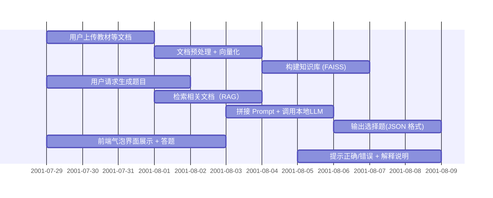

# AIKnowledgeBaseCourseDesign

[TOC]

## test（Future）

## task division
- 组员1（后端负责人：陈德凯）
主要任务：选择题生成模块 + API 接口开发
学习 Prompt Engineering，设计选择题生成格式（ JSON）
写 Python 脚本调用本地模型（用 requests.post 调用 Ollama 接口）
把选择题生成封装成一个 API（如 Flask/FastAPI）
提供 POST /generate-question 接口，返回标准化 JSON 格式题目

比如：
```json
{
  "question": "以下哪项不是大气层的组成部分？",
  "options": ["氮气", "氧气", "二氧化碳", "氢氟酸"],
  "answer": "氢氟酸",
  "explanation": "氢氟酸并不是大气层的正常组成成分。"
}
```

- 组员2（前端/UI负责人：江来）
主要任务：气泡式交互前端开发
学习 Svelte，使用 Tailwind 做美观 UI
实现题目气泡展示（点击选项，反馈对错）
与 API 对接（从后端拿题目数据，渲染在界面上）
基于 Open WebUI 扩展组件，或者单独做答题页
做更多功能扩展

比如：
显示选择题
用户点击选项后给出正确/错误提示
加载下一题、评分等按钮交互

- 组员3（知识库 & 模型集成负责人：张浩然）
主要任务：知识库上传 + 文档向量化 + RAG 实现
使用 LangChain / LlamaIndex / Haystack 等工具
上传文档（.pdf/.txt），分段 -> 向量化（嵌入） -> 存入 FAISS 等
实现基于文档内容的问答（即 RAG）
提供接口：输入问题，模型基于知识库内容生成选择题

比如：
上传一本教材或手册
输入“请基于第3章生成一题选择题”
模型返回题目内容

## procedure
仅供参考


## references
https://github.com/open-webui/open-webui

## origin requirements
本课程助教：李玉泉同学，协助助理：原恒，陈书煊同学，
一共有7道题目，自行组队选题，一组最多不超过3位同学，每队推荐组长一名，组长负责组织本队队员完成课题，评定队员工作量，具有在本队平均分基础上推荐上下浮动5分的权力。
一题最多不超过3组同学选择，题目确定原则为先到先选。题目确定后，请各组同学联系出题导师，后续指导，考核都由各出题老师负责，报告提交截止时间为==8月16号晚23:59分==


- 基于Open WebUI的AI知识库与选择题生成系统开发

		本课题旨在基于开源工具 Open WebUI 构建一个具备知识库管理与自动生成选择题功能的 AI 学习平台。系统通过接入本地或远程大型语言模型，实现用户上传文档的解析、向量化存储、基于内容的问答（RAG），并在此基础上通过提示词工程自动生成结构化的选择题。前端界面采用气泡式交互形式展示题目和反馈，提高用户交互体验。
		学生将在理解 Open WebUI 架构的基础上，完成定制化前后端开发、知识库集成、题目生成 API 接入与前端渲染逻辑设计等任务，完成一个可交互、可部署的 AI 驱动教育平台雏形。
	
	- 系统使用的知识库由学生自行准备（例如教学文档、教材片段、维基百科内容等），支持文本、PDF等格式上传。
	- 每个知识库建议包含10篇以上文档（总字数不低于5万字），以支持高质量题目生成与测试。
	- 模型选择建议使用 Ollama 提供的 Qwen 系列模型或 LLaMA 本地模型，均为 7B 规模左右。
	
	1.     系统搭建：
		部署基于 Docker 的 Open WebUI 与 LLM 运行环境；熟悉项目结构，实现知识库模块的配置与调用；
	2.     功能开发：
		开发选择题生成模块，包括 Prompt 设计、格式约束（JSON）；开发题目生成 API 并接入 Open WebUI 的聊天流程；前端实现气泡式交互，展示题目与答题反馈；
	3.     可用性验证与测试：
		完成系统测试与调优，保证题目相关性、唯一性与可交互性；提交完整代码与可复现部署说明。
